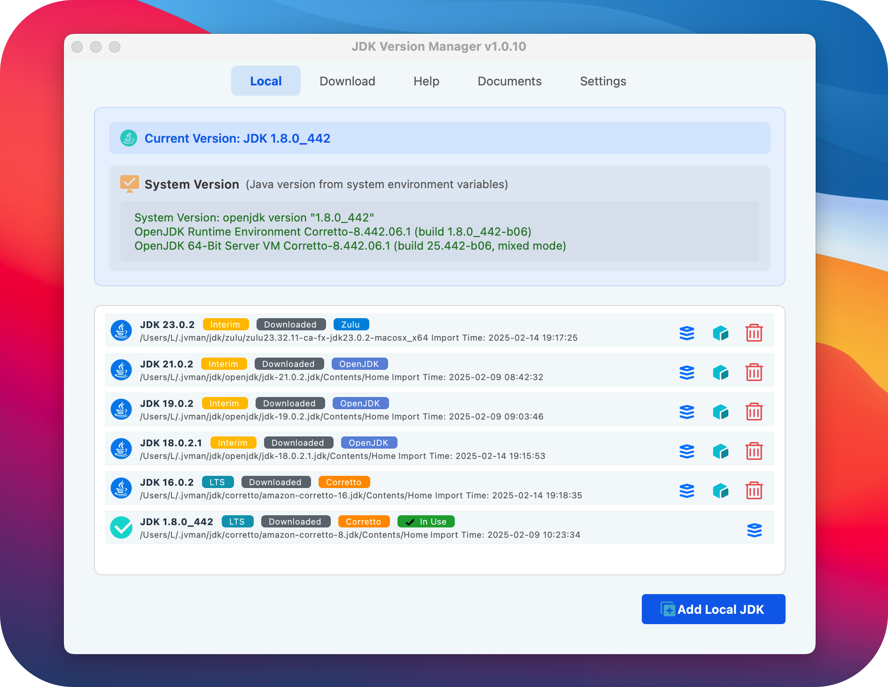

# JDK Version Manager


A user-friendly JDK version management tool supporting Windows, macOS, and Linux platforms.

## Repository
- GitHub: https://github.com/l06066hb/jvman
- Gitee: https://gitee.com/l06066hb/jvman

[中文文档](README.md)

## Features

- 🚀 Online JDK Download: Support multiple JDK distributions (Oracle JDK, OpenJDK, Adoptium, Amazon Corretto, Zulu OpenJDK)
- 📂 Local JDK Management: Easily import and manage installed JDKs
- 🔄 Smart Version Switching: Quick switching between JDK versions, with system tray menu support
- 🛠 Environment Variable Management: Auto-configure JAVA_HOME, PATH, and CLASSPATH with real-time sync status
- 💡 System Tray: Real-time display and quick switching of current JDK version
- 🎨 Theme Switching: Support light, dark, and cyan themes
- 🌐 Internationalization: Support Chinese and English interfaces
- 📚 Documentation Center: Built-in help and API documentation with search functionality
- 🖥 Multi-platform Support:
  - Windows: Version switching using symbolic links
  - macOS: Support Homebrew-installed JDKs, switching via symbolic links
  - Linux: Support apt/yum package manager, switching via symbolic links
- 📝 Logging: Detailed operation logs with file recording
- 🔧 Portable Version: No installation required, just unzip and use
- 🔄 Auto Update: Support checking and downloading new versions

## Screenshots

### Main Interface


## System Requirements

- Windows 10/11, macOS 10.15+, or Linux (major distributions)
- Python 3.8+
- PyQt6 >= 6.4.0
- Disk Space: At least 100MB (excluding downloaded JDKs)

## Installation

### Windows
1. Download the latest installer (recommended)
   - Get the latest installer from [Releases](https://gitee.com/l06066hb/jvman.git/releases)
   - Run the installer and follow the wizard
   - Launch from Start menu or desktop shortcut
2. Portable Version
   - Download the latest ZIP file
   - Extract to any directory
   - Run jvman.exe

### macOS（testing）
1. Download the latest DMG file
2. Open DMG and drag the app to Applications folder
3. Admin password required for first run

### Linux（testing）
1. Download the latest AppImage or deb/rpm package
2. Install the package or run AppImage directly
3. Sudo privileges required for first run

### From Source
1. Clone repository:
```bash
git clone https://gitee.com/l06066hb/jvman.git
cd jvman
```

2. Install dependencies:
```bash
pip install -r requirements.txt
```

3. Run the program:
```bash
python src/main.py
```

## Usage Guide

### Basic Features

#### Local JDK Management
1. Add Local JDK
   - Click "Add Local JDK"
   - Select JDK installation directory
   - Confirm addition
2. Version Switching
   - Select target JDK from list
   - Click "Switch Version" or use tray menu for quick switching
   - Wait for completion

#### Online JDK Download
1. Select JDK distribution and version
2. Choose download directory
3. Click download and wait for completion

##### JDK Distribution Notes
- Oracle JDK: Official distribution, Oracle account required
- OpenJDK: Official open-source version, latest three LTS versions
- Eclipse Temurin: Maintained by Eclipse Foundation, long-term stable support
- Amazon Corretto: Amazon distribution, optimized for cloud environments
- Zulu OpenJDK: Azul distribution, comprehensive version support

##### Download Tips
- Recommend LTS (Long Term Support) versions for production
- If download fails, try:
  1. Use proxy or VPN
  2. Switch to another distribution
  3. Download manually from official website and import
- Some versions may be unavailable due to end of support

### Advanced Features

#### Environment Variable Management
- Auto-configure JAVA_HOME, PATH, and CLASSPATH
- Support both automatic and manual configuration modes
- Real-time environment variable sync status display

#### IDE Integration
- Support major IDEs (IntelliJ IDEA, VS Code, Eclipse)
- Automatic version sync using symlink path
- See [IDE Integration Guide](resources/docs/en_US/ide_integration.md) for details

#### System Tray
- Real-time display of current JDK version
- Quick version switching
- Minimize to tray for background operation

### Platform-Specific Notes

#### Windows
- Uses symbolic links for version switching
- Admin privileges required for system environment variables
- Supports Windows 10/11 native symbolic links

#### macOS
- Supports Homebrew-installed JDKs
- Uses symbolic links for version switching
- Auto-updates shell config files (bash/zsh)
- Admin privileges required for symbolic links

#### Linux
- Supports apt/yum package manager installed JDKs
- Uses symbolic links for version switching
- Auto-updates shell config files (bash/zsh/fish)
- Sudo privileges required for symbolic links

### Important Notes
- Recommend using ZIP version JDKs to avoid conflicts
- Admin/sudo privileges required for first use
- Try manual download if automatic download fails
- Unix systems need shell config reload for environment variables

### Download Sources
- Oracle JDK: https://www.oracle.com/java/technologies/downloads/
- OpenJDK: https://jdk.java.net/
- Eclipse Temurin (Adoptium): https://adoptium.net/temurin/releases/
- Amazon Corretto: https://aws.amazon.com/corretto/
- Zulu OpenJDK: https://www.azul.com/downloads/

## Build Instructions

### Build Portable Version
```bash
python scripts/build.py --platform windows --type portable
```

### Build Installer
```bash
python scripts/build.py --platform windows --type installer
```

### Build All
```bash
python scripts/build.py --platform windows --type all
```

## Latest Version

v1.0.7 Major Updates:
- ✨ Add hash verification for update packages, enhancing security
- 📦 Add release.json file with version info and file hashes
- 🎨 Optimize resource file structure and build process

For complete release notes, please check [CHANGELOG.md](CHANGELOG.md)

## Contributing

We welcome Issues and Pull Requests to help improve this project.

#### Development Environment Setup
1. Ensure Python 3.8 or higher is installed
2. Install virtual environment (recommended):
```bash
python -m venv venv
source venv/bin/activate  # Windows: venv\Scripts\activate
```
3. Install development dependencies:
```bash
pip install -r requirements-dev.txt
```

4. Security Notes:
- Don't hardcode any keys or sensitive information
- Use .env file for local config (excluded in .gitignore)
- Ensure sensitive information isn't committed

#### Code Submission
1. Fork the project to your repository
2. Create a feature branch:
```bash
git checkout -b feature/your-feature-name
```
3. Commit changes:
```bash
git commit -am 'Add new feature: feature description'
```
4. Push to your repository:
```bash
git push origin feature/your-feature-name
```
5. Create Pull Request

#### Code Standards
- Code Style
  - Follow [PEP 8](https://peps.python.org/pep-0008/) coding standards
  - Use [Black](https://black.readthedocs.io/) for code formatting (line length: 88)
  - Use [isort](https://pycqa.github.io/isort/) for import sorting
  - Use [flake8](https://flake8.pycqa.org/) for code quality checks
  - Use [mypy](https://mypy.readthedocs.io/) for type checking

- Commit Standards
  - Run unit tests before submission: `pytest tests/`
  - Commit message format:
    ```
    <type>: <description>

    <optional detailed description>
    ```
  - Type definitions:
    - feat: New feature (e.g., add dark theme)
    - fix: Bug fix (e.g., fix environment variable setup)
    - docs: Documentation changes (e.g., update README)
    - style: Code style changes (e.g., adjust indentation)
    - refactor: Code refactoring (e.g., refactor config management)
    - test: Test case related (e.g., add unit tests)
    - chore: Other changes (e.g., update dependencies)

## Project Structure
```
jvman/
├── src/                # Source code directory
│   ├── ui/            # User interface code
│   ├── utils/         # Utility classes and helper functions
│   └── i18n/          # Internationalization resources
├── tests/             # Test cases
├── docs/              # Documentation
├── scripts/           # Build and utility scripts
├── config/            # Configuration files
├── resources/         # Resource files
│   └── icons/        # Icon resources
└── requirements/      # Dependency configuration files
```

## FAQ

### Q: How to fix environment variable setup failure?
A: Ensure running with admin privileges or manually copy environment variable values.

### Q: What to do if download is slow?
A: Configure proxy server in settings or use manual download feature.

### Q: How to backup current configuration?
A: Program config files are stored in `%APPDATA%/jvman`, simply copy this directory.

### Q: How to handle version switch failure?
A: Check for sufficient privileges and ensure target JDK directory exists and is complete.

## License

This project is licensed under the MIT License - see the [LICENSE](LICENSE) file for details.

## Update Sources
You can select update source in settings:
- GitHub (International)
- Gitee (Mainland China)