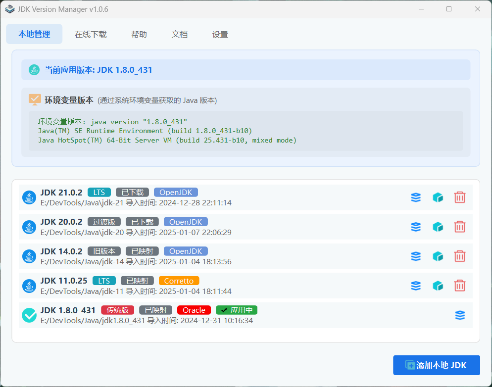

# JDK 版本管理工具 (JDK Version Manager)


一个简单易用的 JDK 版本管理工具，支持 Windows、macOS 和 Linux 平台。

[English Document](README.en.md)

## 功能特点

- 🚀 在线下载 JDK：支持多个 JDK 发行版（Oracle JDK、OpenJDK、Adoptium、Amazon Corretto、Zulu OpenJDK）
- 📂 本地 JDK 管理：轻松导入和管理已安装的 JDK
- 🔄 智能版本切换：快速切换不同版本的 JDK，支持多平台和托盘菜单快速切换
- 🛠 环境变量管理：自动配置 JAVA_HOME、PATH 和 CLASSPATH，实时显示同步状态
- 💡 系统托盘：实时显示和快速切换当前 JDK 版本
- 🎨 主题切换：支持浅色、深色和青色主题
- 🌐 国际化：支持中文和英文界面
- 📚 文档中心：内置帮助文档和 API 文档，支持搜索功能
- 🖥 多平台支持：
  - Windows：使用符号链接进行版本切换
  - macOS：支持 Homebrew 安装的 JDK，使用符号链接切换
  - Linux：支持 apt/yum 包管理器，使用符号链接切换
- 📝 日志记录：详细的操作日志，支持文件记录
- 🔧 便携版支持：无需安装，解压即用
- 🔄 自动更新：支持检查和下载新版本

## 程序截图

### 主界面


## 系统要求

- Windows 10/11、macOS 10.15+ 或 Linux（主流发行版）
- Python 3.8+
- PyQt6 >= 6.4.0
- 磁盘空间：至少 100MB（不含下载的 JDK）

## 安装使用

### Windows
1. 下载最新版本的安装包（推荐）
   - 从 [Releases](https://gitee.com/l06066hb/jvman.git/releases) 页面下载最新的安装包
   - 运行安装程序，按照向导完成安装
   - 从开始菜单或桌面快捷方式启动程序
2. 便携版
   - 下载最新的便携版 ZIP 文件
   - 解压到任意目录
   - 运行 jvman.exe

### macOS
1. 下载最新版本的 DMG 文件
2. 打开 DMG 文件并将应用拖到应用程序文件夹
3. 首次运行时需要输入管理员密码

### Linux
1. 下载最新版本的 AppImage 或 deb/rpm 包
2. 安装对应的包或直接运行 AppImage
3. 首次运行时需要 sudo 权限

### 从源码安装
1. 克隆仓库：
```bash
git clone https://gitee.com/l06066hb/jvman.git
cd jvman
```

2. 安装依赖：
```bash
pip install -r requirements.txt
```

3. 运行程序：
```bash
python src/main.py
```

## 使用说明

### 在线下载 JDK
1. 选择 JDK 发行版和版本
2. 选择下载目录
3. 点击下载并等待完成

### JDK 下载源
- Oracle JDK: https://www.oracle.com/java/technologies/downloads/
- OpenJDK: https://jdk.java.net/
- Eclipse Temurin (Adoptium): https://adoptium.net/temurin/releases/
- Amazon Corretto: https://aws.amazon.com/corretto/
- Zulu OpenJDK: https://www.azul.com/downloads/

### 下载源说明
- Oracle JDK: 官方发行版，需要 Oracle 账号下载
- OpenJDK: 官方开源版本，仅提供最新的三个 LTS 版本和最新开发版
- Eclipse Temurin: 由 Eclipse 基金会维护，提供长期稳定支持
- Amazon Corretto: 亚马逊发行版，针对云环境优化
- Zulu OpenJDK: Azul 发行版，提供全面的版本支持

### 下载建议
- 建议选择 LTS（长期支持）版本用于生产环境
- 如遇下载失败，可尝试：
  1. 使用代理或 VPN
  2. 切换到其他发行版
  3. 直接从官方网站下载后手动导入
- 部分版本可能因官方停止支持而无法下载，建议查看各发行版的生命周期说明

### 本地 JDK 管理
1. 点击"添加本地 JDK"
2. 选择 JDK 安装目录
3. 确认添加

### 切换 JDK 版本
1. 在列表中选择目标 JDK
2. 点击"切换版本"
3. 等待切换完成

### 平台特定说明

#### Windows
- 使用符号链接进行版本切换
- 需要管理员权限修改系统环境变量
- 支持 Windows 10/11 的原生符号链接

#### macOS
- 支持 Homebrew 安装的 JDK
- 使用符号链接进行版本切换
- 自动更新 shell 配置文件（bash/zsh）
- 需要管理员权限创建符号链接

#### Linux
- 支持 apt/yum 包管理器安装的 JDK
- 使用符号链接进行版本切换
- 自动更新 shell 配置文件（bash/zsh/fish）
- 需要 sudo 权限创建符号链接

### 注意事项
- 建议使用 ZIP 版本的 JDK，避免与已安装版本的环境变量冲突
- 首次使用时需要管理员/sudo 权限以配置环境变量
- 如遇下载失败，可尝试使用手动下载功能
- Unix 系统（macOS/Linux）需要重新加载 shell 配置文件使环境变量生效

### IDE 集成
本工具支持与主流 IDE（如 IntelliJ IDEA、VS Code、Eclipse）无缝集成。通过配置 IDE 使用软链接路径，可以实现 IDE 环境与系统 JDK 版本的自动同步。

#### 快速配置
1. 使用软链接路径（默认位置）：
   - Windows: `%LOCALAPPDATA%\Programs\jvman\current`
   - macOS: `/usr/local/opt/jvman/current`
   - Linux: `/usr/local/jvman/current`

2. 主流 IDE 配置示例：
   - IntelliJ IDEA: 在 Settings > Build Tools > Gradle/Maven 中配置 JDK 路径
   - VS Code: 在 settings.json 中配置 java.home
   - Eclipse: 在 Installed JREs 中添加 JDK 路径

详细配置指南请参考：
- [IDE 集成指南（中文）](resources/docs/zh_CN/ide_integration.md)
- [IDE Integration Guide (English)](resources/docs/en_US/ide_integration.md)

## 构建说明

### 构建便携版
```bash
python scripts/build.py --platform windows --type portable
```

### 构建安装版
```bash
python scripts/build.py --platform windows --type installer
```

### 构建全部
```bash
python scripts/build.py --platform windows --type all
```

## 更新日志

### v1.0.6
- 优化帮助文档和国际化支持
- 改进 IDE 配置指南内容
- 完善中英文翻译质量
- 优化文档搜索功能
- 改进文档显示样式
- 修复国际化切换问题
- 优化文档内容格式化
- 统一中英文文案风格

### v1.0.5
- 新增托盘菜单版本切换功能，支持快速切换 JDK 版本
- 托盘图标实时显示当前使用的 JDK 版本
- 优化环境变量设置界面，添加同步状态显示
- 改进界面样式，统一滚动条外观和交互体验
- 修复多个界面同步和状态更新问题

### v1.0.4 (2024-01-05)
- 添加安装包支持
- 添加多平台支持（Windows/macOS/Linux）
- 优化版本切换机制，支持不同平台的符号链接
- 添加包管理器支持（Homebrew/apt/yum）
- 改进 shell 配置文件管理
- 优化环境变量设置方式
- 提升程序稳定性
- 优化构建系统，支持便携版和安装版
- 统一版本管理，使用 app.json 集中配置
- 改进图标显示和资源管理
- 优化日志系统，支持文件记录

### v1.0.3 (2024-12-28)
- 修复主题切换保存问题
- 修复程序退出时配置保存问题
- 优化配置管理功能
- 提升程序稳定性

### v1.0.2 (2024-12-26)
- 优化界面布局和样式
- 改进环境变量设置面板
- 修复主题切换相关问题
- 优化版本信息显示
- 添加使用建议说明

### v1.0.1 (2024-12-25)
- 优化界面样式和用户体验
- 修复本地 JDK 重复添加问题
- 改进版本切换功能
- 优化下载进度显示
- 增加详细版本信息显示

### v1.0.0 (2024-01-01)
- 首次发布
- 基本功能实现

## 贡献指南

欢迎提交 Issue 和 Pull Request 来帮助改进这个项目。

### 开发环境设置
1. 确保安装了 Python 3.8 或更高版本
2. 安装虚拟环境（推荐）：
```bash
python -m venv venv
source venv/bin/activate  # Windows: venv\Scripts\activate
```
3. 安装开发依赖：
```bash
pip install -r requirements-dev.txt
```

### 代码规范
- 遵循 PEP 8 编码规范
- 使用 Black 进行代码格式化
- 提交前运行单元测试
- 编写清晰的提交信息

### 提交 Pull Request
1. Fork 本仓库
2. 创建特性分支 (`git checkout -b feature/AmazingFeature`)
3. 提交更改 (`git commit -m 'Add some AmazingFeature'`)
4. 推送到分支 (`git push origin feature/AmazingFeature`)
5. 开启 Pull Request

## 项目结构
```
jvman/
├── src/                # 源代码目录
│   ├── ui/            # 用户界面相关代码
│   ├── utils/         # 工具类和辅助函数
│   └── i18n/          # 国际化资源文件
├── tests/             # 测试用例
├── docs/              # 文档
├── scripts/           # 构建和工具脚本
├── config/            # 配置文件
├── resources/         # 资源文件
│   └── icons/        # 图标资源
└── requirements/      # 依赖配置文件
```

## 常见问题

### Q: 如何解决环境变量设置失败？
A: 请确保以管理员权限运行程序，或手动复制环境变量值进行设置。

### Q: 下载速度较慢怎么办？
A: 可以在设置中配置代理服务器，或使用手动下载功能。

### Q: 如何备份当前配置？
A: 程序配置文件存储在 `%APPDATA%/jvman` 目录下，可直接复制该目录进行备份。

### Q: 如何处理版本切换失败？
A: 检查是否有足够的权限，确保目标 JDK 目录存在且完整。

## 安全说明
如发现任何安全漏洞，请发送邮件至 [security@example.com](mailto:security@example.com)。

## 许可证

本项目采用 MIT 许可证，详见 [LICENSE](LICENSE) 文件。 