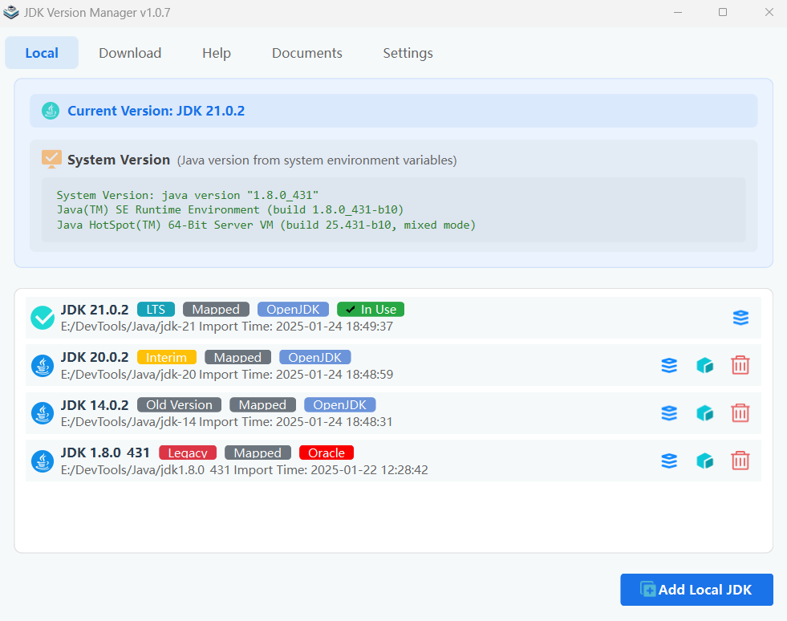

# JDK Version Manager

[](https://github.com/l06066hb/jvman/releases)
[](https://github.com/l06066hb/jvman)
[](https://www.python.org/)
[](LICENSE)
[](https://github.com/l06066hb/jvman/actions)
[](https://github.com/l06066hb/jvman/releases)
[](https://github.com/l06066hb/jvman/releases/latest)
[](https://github.com/l06066hb/jvman/stargazers)
[](https://ko-fi.com/l06066hb)
[](https://afdian.com/a/l06066hb)

A user-friendly JDK version management tool supporting Windows, macOS, and Linux platforms.

[English](README.md) | [简体中文](README.zh-CN.md)

## Repository
- GitHub: https://github.com/l06066hb/jvman
- Gitee: https://gitee.com/l06066hb/jvman

## Features

- 🚀 Online JDK Download: Support major JDK distributions (Oracle JDK, OpenJDK, Eclipse Temurin, Microsoft OpenJDK, Amazon Corretto, Azul Zulu)
- 📂 Local JDK Management: Support importing and managing locally installed JDKs, including package manager installations
- 🔄 Smart Version Switching: Seamless switching through symbolic links, with quick access from system tray menu
- 🛠 Environment Variable Management: Auto-configure and sync environment variables (JAVA_HOME, PATH, CLASSPATH), with backup and restore support
- 💡 System Tray: Display current JDK version, support quick switching and status monitoring
- 🎨 Theme Switching: Built-in light, dark, and cyan themes with system theme auto-follow
- 🌐 Internationalization: Complete Chinese and English interface support with runtime switching
- 📚 Documentation: Built-in detailed user guide with search and quick navigation
- 🖥 Multi-platform Support:
  - Windows: Support Windows 10/11 native symbolic links, auto-configure system environment variables
  - macOS: Support symbolic link switching, auto-update shell configuration (bash/zsh)
  - Linux: Support symbolic link switching, auto-update shell configuration files (bash/zsh/fish)
- 🔧 Portable Mode: Support both portable (standalone) and installer versions
- 🔄 Auto Update: Support online update checking with configurable update cycle and notification

## Screenshots

### Main Interface


## System Requirements

- Windows 10/11, macOS 10.15+, or Linux (major distributions)
- Python 3.8+
- PyQt6 >= 6.4.0
- Disk Space: At least 100MB (excluding downloaded JDKs)

## Installation

### Download
- [GitHub Releases](https://github.com/l06066hb/jvman/releases) (International)
- [Gitee Releases](https://gitee.com/l06066hb/jvman/releases) (Mainland China)

### Windows
1. Installer Version
   - Download and run the latest installer (jvman-x.x.x-windows-setup.exe)
   - Follow the installation wizard
   - Launch from Start menu or desktop shortcut
2. Portable Version
   - Download the latest ZIP file
   - Extract to any directory
   - Run jvman.exe

### macOS
1. Download the latest DMG file
2. Open DMG and drag the app to Applications folder
3. Run jvman.app

### Linux（testing）
1. Download the latest AppImage or deb/rpm package
2. Install the package or run AppImage directly

### From Source
1. Clone repository:
```bash
git clone https://gitee.com/l06066hb/jvman.git or https://github.com/l06066hb/jvman.git
cd jvman
```

2. Install dependencies:
```bash
pip install -r requirements.txt
```

3. Run the program:
```bash
python src/main.py
```

## Usage Guide

### Basic Features

#### Local JDK Management
1. Add Local JDK
   - Click "Add Local JDK"
   - Select JDK installation directory
   - Confirm addition
2. Version Switching
   - Select target JDK from list
   - Click "Switch Version" or use tray menu for quick switching
   - Wait for completion

#### Online JDK Download
1. Select JDK distribution and version
2. Choose download directory
3. Click download and wait for completion

##### JDK Distribution Notes
- Oracle JDK: Official distribution, Oracle account required
- OpenJDK: Official open-source version
- Eclipse Temurin: Maintained by Eclipse Foundation, long-term stable support
- Amazon Corretto: Amazon distribution, optimized for cloud environments
- Zulu OpenJDK: Azul distribution, comprehensive version support

##### Download Tips
- Recommend LTS (Long Term Support) versions for production
- If download fails, try:
  1. Use proxy or VPN
  2. Switch to another distribution
  3. Download manually from official website and import
- Some versions may be unavailable due to end of support

### Advanced Features

#### Environment Variable Management
- Auto-configure JAVA_HOME, PATH, and CLASSPATH
- Support both automatic and manual configuration modes
- Real-time environment variable sync status display

#### IDE Integration
- Support major IDEs (IntelliJ IDEA, VS Code, Eclipse)
- Automatic version sync using symlink path
- See [IDE Integration Guide](resources/docs/en_US/ide_integration.md) for details

#### System Tray
- Real-time display of current JDK version
- Quick version switching
- Minimize to tray for background operation

### Platform-Specific Notes

#### Windows
- Uses symbolic links for version switching
- Admin privileges required for system environment variables
- Supports Windows 10/11 native symbolic links
- Auto-configures system environment variables (JAVA_HOME, PATH)

#### macOS
- Uses symbolic links for version switching
- Auto-updates shell config files (~/.zshrc, ~/.bash_profile)

#### Linux
- Uses symbolic links for version switching
- Auto-updates shell config files (~/.bashrc, ~/.zshrc)

### Important Notes
- Recommend using ZIP version JDKs to avoid conflicts
- Try manual download if automatic download fails

### Download Sources
- Oracle JDK: https://www.oracle.com/java/technologies/downloads/
- OpenJDK: https://jdk.java.net/
- Eclipse Temurin (Adoptium): https://adoptium.net/temurin/releases/
- Amazon Corretto: https://aws.amazon.com/corretto/
- Zulu OpenJDK: https://www.azul.com/downloads/

## Build Instructions

### Build Portable Version
```bash
python scripts/build.py --platform windows --type portable
```

### Build Installer
```bash
python scripts/build.py --platform windows --type installer
```

### Build All
```bash
python scripts/build.py --platform windows --type all
```

## Latest Version

v1.0.12 Major Updates:
- ✨ [Added] Added macOS Apple Silicon (M-series) native build (macOS-14 runner)
- ✨ [Added] Added Linux ARM64 build (ubuntu-24.04-arm runner)
- ✨ [Added] Intel/ARM version
- ✨ [Added] Arch installation/portable bag
- 🔄 [Changed] Python version upgraded from 3.8 to 3.11 (3.8 does not support Apple Silicon native)
- 🔄 [Changed] The Architecture field of the installation package has been changed from hard coded AMD64 to dynamically generated based on the build architecture

For complete release notes, please check [CHANGELOG.en.md](CHANGELOG.en.md)


## Contributing

We welcome Issues and Pull Requests to help improve this project.

#### Development Environment Setup
1. Ensure Python 3.8 or higher is installed
2. Install virtual environment (recommended):
```bash
python -m venv venv
source venv/bin/activate  # Windows: venv\Scripts\activate
```
3. Install development dependencies:
```bash
pip install -r requirements-dev.txt
```

4. Security Notes:
- Don't hardcode any keys or sensitive information
- Use .env file for local config (excluded in .gitignore)
- Ensure sensitive information isn't committed

#### Code Submission
1. Fork the project to your repository
2. Create a feature branch:
```bash
git checkout -b feature/your-feature-name
```
3. Commit changes:
```bash
git commit -am 'Add new feature: feature description'
```
4. Push to your repository:
```bash
git push origin feature/your-feature-name
```
5. Create Pull Request

#### Code Standards
- Code Style
  - Follow [PEP 8](https://peps.python.org/pep-0008/) coding standards
  - Use [Black](https://black.readthedocs.io/) for code formatting (line length: 88)
  - Use [isort](https://pycqa.github.io/isort/) for import sorting
  - Use [flake8](https://flake8.pycqa.org/) for code quality checks
  - Use [mypy](https://mypy.readthedocs.io/) for type checking

- Commit Standards
  - Run unit tests before submission: `pytest tests/`
  - Commit message format:
    ```
    <type>: <description>

    <optional detailed description>
    ```
  - Type descriptions:
    - feat: New feature (e.g., adding dark theme)
    - fix: Bug fix (e.g., fixing environment variable setup)
    - docs: Documentation changes (e.g., updating README)
    - style: Code formatting (e.g., adjusting indentation)
    - refactor: Code refactoring (e.g., restructuring configuration)
    - perf: Performance optimization (e.g., improving download speed)
    - test: Test cases (e.g., adding unit tests)
    - ci: Continuous integration (e.g., modifying GitHub Actions)
    - chore: Other changes (e.g., updating dependencies)

## Project Structure
```
jvman/
├── src/                # Source code directory
│   ├── ui/            # User interface code
│   ├── utils/         # Utility classes and helper functions
│   └── i18n/          # Internationalization resources
├── tests/             # Test cases
├── docs/              # Documentation
├── scripts/           # Build and utility scripts
├── config/            # Configuration files
├── resources/         # Resource files
│   └── icons/        # Icon resources
└── requirements/      # Dependency configuration files
```

## FAQ

### Q: How to fix environment variable setup failure?
A: Ensure running with admin privileges or manually copy environment variable values.

### Q: What to do if download is slow?
A: Configure proxy server in settings or use manual download feature.

### Q: How to backup current configuration?
A: Program config files are stored in `%APPDATA%/jvman`, simply copy this directory.

### Q: How to handle version switch failure?
A: Check for sufficient privileges and ensure target JDK directory exists and is complete.

## License

This project is licensed under the MIT License - see the [LICENSE](LICENSE) file for details.

## Support the Project

If this project has been helpful to you, you can:

- ⭐ Star this project
- 🐛 Submit Issues or Pull Requests
- 💬 Help answer other users' questions
- 💝 Sponsor the developer:
    - **China** — [Afdian / 爱发电](https://afdian.com/a/l06066hb) (WeChat Pay / Alipay)
    - **International** — [Ko-fi](https://ko-fi.com/l06066hb) (Visa / PayPal)
- 📖 See [sponsor guide](docs/sponsor.md) for more options

Your support helps maintain and improve the project. Thank you to everyone who contributes!