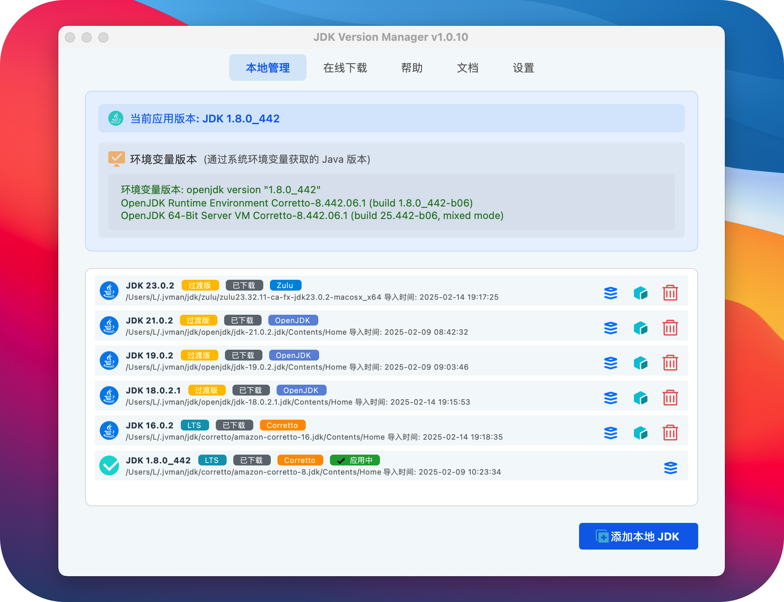

# JDK 版本管理工具 (JDK Version Manager)

[](https://github.com/l06066hb/jvman/releases)
[](https://github.com/l06066hb/jvman)
[](https://www.python.org/)
[](LICENSE)
[](https://github.com/l06066hb/jvman/actions)
[](https://opencollective.com/jvman)

一个简单易用的 JDK 版本管理工具，支持 Windows、macOS 和 Linux 平台。

## 代码仓库
- GitHub: https://github.com/l06066hb/jvman
- Gitee: https://gitee.com/l06066hb/jvman

[English Document](README.en.md)

## 功能特点

- 🚀 在线下载 JDK：支持多个 JDK 发行版（Oracle JDK、OpenJDK、Adoptium、Amazon Corretto、Zulu OpenJDK）
- 📂 本地 JDK 管理：轻松导入和管理已安装的 JDK
- 🔄 智能版本切换：快速切换不同版本的 JDK，支持多平台和托盘菜单快速切换
- 🛠 环境变量管理：自动配置 JAVA_HOME、PATH 和 CLASSPATH，实时显示同步状态
- 💡 系统托盘：实时显示和快速切换当前 JDK 版本
- 🎨 主题切换：支持浅色、深色和青色主题
- 🌐 国际化：支持中文和英文界面
- 📚 文档中心：内置帮助文档和 API 文档，支持搜索功能
- 🖥 多平台支持：
  - Windows：使用符号链接进行版本切换
  - macOS：支持 Homebrew 安装的 JDK，使用符号链接切换
  - Linux：支持 apt/yum 包管理器，使用符号链接切换
- 📝 日志记录：详细的操作日志，支持文件记录
- 🔧 便携版支持：无需安装，解压即用
- 🔄 自动更新：支持检查和下载新版本

## 程序截图

### 主界面


## 系统要求

- Windows 10/11、macOS 10.15+ 或 Linux（主流发行版）
- Python 3.8+
- PyQt6 >= 6.4.0
- 磁盘空间：至少 100MB（不含下载的 JDK）

## 安装使用

### 下载
- [GitHub Releases](https://github.com/l06066hb/jvman/releases) (国际)
- [Gitee 发行版](https://gitee.com/l06066hb/jvman/releases) (中国大陆)

### Windows
1. 安装版
   - 下载并运行最新的安装程序 (jvman-setup-x.x.x.exe)
   - 按照安装向导完成安装
   - 从开始菜单或桌面快捷方式启动程序
2. 便携版
   - 下载最新的便携版 ZIP 文件
   - 解压到任意目录
   - 运行 jvman.exe

### macOS (测试中)
1. 下载最新版本的 DMG 文件
2. 打开 DMG 文件并将应用拖到应用程序文件夹
3. 首次运行时需要输入管理员密码

### Linux (测试中)
1. 下载最新版本的 AppImage 或 deb/rpm 包
2. 安装对应的包或直接运行 AppImage
3. 首次运行时需要 sudo 权限

### 从源码安装
1. 克隆仓库：
```bash
git clone https://gitee.com/l06066hb/jvman.git
cd jvman
```

2. 安装依赖：
```bash
pip install -r requirements.txt
```

3. 运行程序：
```bash
python src/main.py
```

## 使用说明

### 基础功能

#### 本地 JDK 管理
1. 添加本地 JDK
   - 点击"添加本地 JDK"
   - 选择 JDK 安装目录
   - 确认添加
2. 版本切换
   - 在列表中选择目标 JDK
   - 点击"切换版本"或使用托盘菜单快速切换
   - 等待切换完成

#### 在线下载 JDK
1. 选择 JDK 发行版和版本
2. 选择下载目录
3. 点击下载并等待完成

##### JDK 发行版说明
- Oracle JDK: 官方发行版，需要 Oracle 账号下载
- OpenJDK: 官方开源版本，提供最新的三个 LTS 版本
- Eclipse Temurin: Eclipse 基金会维护，提供长期稳定支持
- Amazon Corretto: 亚马逊发行版，针对云环境优化
- Zulu OpenJDK: Azul 发行版，提供全面的版本支持

##### 下载建议
- 建议选择 LTS（长期支持）版本用于生产环境
- 如遇下载失败，可尝试：
  1. 使用代理或 VPN
  2. 切换到其他发行版
  3. 直接从官方网站下载后手动导入
- 部分版本可能因官方停止支持而无法下载，建议查看各发行版的生命周期说明

### 高级功能

#### 环境变量管理
- 自动配置 JAVA_HOME、PATH 和 CLASSPATH
- 支持自动和手动两种配置模式
- 实时显示环境变量同步状态

#### IDE 集成
- 支持主流 IDE（IntelliJ IDEA、VS Code、Eclipse）
- 使用软链接路径实现自动版本同步
- 详细配置说明见 [IDE 集成指南](resources/docs/zh_CN/ide_integration.md)

#### 系统托盘
- 实时显示当前 JDK 版本
- 快速切换版本
- 最小化到托盘继续运行

### 平台特定说明

#### Windows
- 使用符号链接进行版本切换
- 需要管理员权限修改系统环境变量
- 支持 Windows 10/11 的原生符号链接

#### macOS
- 支持 Homebrew 安装的 JDK
- 使用符号链接进行版本切换
- 自动更新 shell 配置文件（bash/zsh）
- 需要管理员权限创建符号链接

#### Linux
- 支持 apt/yum 包管理器安装的 JDK
- 使用符号链接进行版本切换
- 自动更新 shell 配置文件（bash/zsh/fish）
- 需要 sudo 权限创建符号链接

### 注意事项
- 建议使用 ZIP 版本的 JDK，避免与已安装版本的环境变量冲突
- 首次使用时需要管理员/sudo 权限以配置环境变量
- 如遇下载失败，可尝试使用手动下载功能
- Unix 系统（macOS/Linux）需要重新加载 shell 配置文件使环境变量生效

### 下载源
- Oracle JDK: https://www.oracle.com/java/technologies/downloads/
- OpenJDK: https://jdk.java.net/
- Eclipse Temurin (Adoptium): https://adoptium.net/temurin/releases/
- Amazon Corretto: https://aws.amazon.com/corretto/
- Zulu OpenJDK: https://www.azul.com/downloads/

## 构建说明

### 构建便携版
```bash
python scripts/build.py --platform windows --type portable
```

### 构建安装版
```bash
python scripts/build.py --platform windows --type installer
```

### 构建全部
```bash
python scripts/build.py --platform windows --type all
```

## 最新版本

v1.0.8 的主要更新：
- ✨ [Added] Microsoft OpenJDK 的完整支持
- ✨ [Added] JDK 版本特性的详细说明
- ✨ [Added] - 添加各发行商的特性和支持策略说明
- ✨ [Added] LTS/STS 版本的区分标识
- ✨ [Added] - 添加版本信息的国际化支持
- ✨ [Added] - 添加版本详情的样式优化

完整的更新历史请查看 [CHANGELOG.md](CHANGELOG.md)


## 贡献指南

欢迎提交 Issue 和 Pull Request 来帮助改进这个项目。

#### 开发环境设置
1. 确保安装了 Python 3.8 或更高版本
2. 安装虚拟环境（推荐）：
```bash
python -m venv venv
source venv/bin/activate  # Windows: venv\Scripts\activate
```
3. 安装开发依赖：
```bash
pip install -r requirements-dev.txt
```

4. 安全注意事项：
- 不要在代码中硬编码任何密钥或敏感信息
- 使用 .env 文件存储本地配置（已在 .gitignore 中排除）
- 确保敏感信息不会被提交到代码库

#### 代码提交
1. Fork 项目到自己的仓库
2. 创建功能分支：
```bash
git checkout -b feature/your-feature-name
```
3. 提交更改：
```bash
git commit -am '添加新功能：功能描述'
```
4. 推送到你的仓库：
```bash
git push origin feature/your-feature-name
```
5. 创建 Pull Request

#### 代码规范
- 代码风格
  - 遵循 [PEP 8](https://peps.python.org/pep-0008/) 编码规范
  - 使用 [Black](https://black.readthedocs.io/) 进行代码格式化（行长度限制：88）
  - 使用 [isort](https://pycqa.github.io/isort/) 对导入进行排序
  - 使用 [flake8](https://flake8.pycqa.org/) 进行代码质量检查
  - 使用 [mypy](https://mypy.readthedocs.io/) 进行类型检查

- 提交规范
  - 提交前运行单元测试：`pytest tests/`
  - 提交信息格式：
    ```
    <类型>: <描述>

    <可选的详细描述>
    ```
  - 类型说明：
    - feat: 新功能（比如添加深色主题）
    - fix: 修复问题（比如修复环境变量设置）
    - docs: 文档变更（比如更新 README）
    - style: 代码格式修改（比如调整缩进）
    - refactor: 代码重构（比如重构配置管理）
    - perf: 性能优化（比如优化下载速度）
    - test: 测试用例相关（比如添加单元测试）
    - ci: 持续集成相关（比如修改 GitHub Actions）
    - chore: 其他修改（比如更新依赖）


## 项目结构
```
jvman/
├── src/                # 源代码目录
│   ├── ui/            # 用户界面相关代码
│   ├── utils/         # 工具类和辅助函数
│   └── i18n/          # 国际化资源文件
├── tests/             # 测试用例
├── docs/              # 文档
├── scripts/           # 构建和工具脚本
├── config/            # 配置文件
├── resources/         # 资源文件
│   └── icons/        # 图标资源
└── requirements/      # 依赖配置文件
```

## 常见问题

### Q: 如何解决环境变量设置失败？
A: 请确保以管理员权限运行程序，或手动复制环境变量值进行设置。

### Q: 下载速度较慢怎么办？
A: 可以在设置中配置代理服务器，或使用手动下载功能。

### Q: 如何备份当前配置？
A: 程序配置文件存储在 `%APPDATA%/jvman` 目录下，可直接复制该目录进行备份。

### Q: 如何处理版本切换失败？
A: 检查是否有足够的权限，确保目标 JDK 目录存在且完整。

## 许可证

本项目采用 MIT 许可证，详见 [LICENSE](LICENSE) 文件。

## 支持项目

如果这个项目对你有帮助，你可以：

- ⭐ Star 这个项目
- 🐛 提交 Issue 或 Pull Request
- 💬 帮助解答其他用户的问题
- 💝 [打赏开发者](docs/sponsor.md)

感谢所有支持这个项目的朋友！